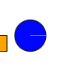
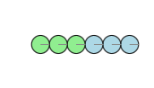

# EE520_FinalProject_PushGame
Final project for EE520 WI2024
===
Overview
===

In my Final Project, I will utilize the Enviro environment to develop a game. The objective of the game is to control two players: Player 1, represented by the Blue Circle, and Player 2, represented by the Green Square. The goal for each player is to maneuver their respective robot to push their balls into designated buckets. The first player to successfully place all of their balls into the bucket will win.

Each robot in the game possesses distinct attributes such as speed, mass, friction properties, shape, and size. Player 1's robot moves at a higher speed but is challenging to decelerate. It is also smaller in size and exerts significant force upon contact with the balls or moving blocks, resulting in difficulties in controlling its movements. On the other hand, Player 2's robot moves at a slower pace and has a lower impact force. However, the square shape introduces unpredictability in its rotation, potentially causing the ball or moving blocks to be struck at varying angles upon contact, thereby making direction control more challenging.

Player 1 will use W,S,A,and D to control its robot



Player 2 will use I,J,K,and L to control its robot.


Using keyboard inputs, players will attempt to navigate their robots to push the balls towards the designated buckets located at the corners of the game environment. User 1's objective is to guide all the light blue balls into the left bucket corner, while User 2 aims to push all the light green balls into the right bucket corner.




To enhance the game's level of difficulty, I've introduced static blocks (colored gray) and movable blocks (colored orange). These additional elements add complexity to the gameplay, requiring players to navigate their robots strategically to avoid obstacles and effectively manipulate the movable blocks. The primary objective remains unchanged: the first player to successfully guide all three balls into their designated bucket will emerge as the winner.


In this project, I reference to enviro github repo and week 9 eep520-wi24to get users input on keyboard and reflect the change of the robots in my play area.


Instruction to start the game
===
Before running the game, make sure you use clone this Github Respositories and usedocker to run Enviro:
```
git clone https://github.com/blueluu97/EE520_FinalProject_PushGame.git
docker run -p80:80 -p8765:8765 -v $PWD:/source -it klavins/enviro:v1.1 bash
```

Then navigate to the game file using
```
cd FinalProject/
```

After that, you have to start the environment using:
```
esm start
```

Then run the game using:
```
make
enviro
```

Then navigate to http://localhost you should see a rectangular play ground there with all the robots ready to play.
